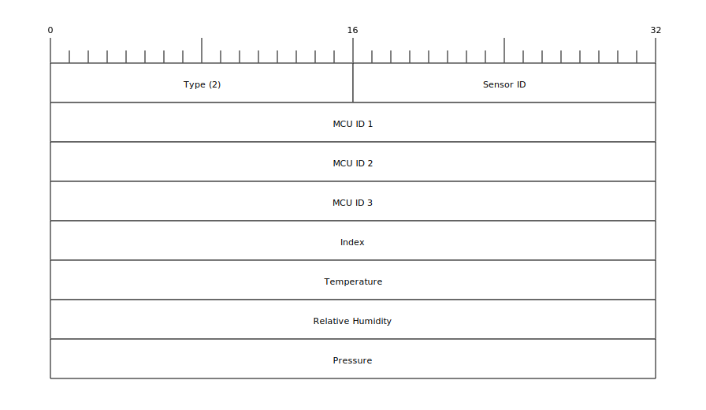

# Sensor Net Middleware

Middleware for the [Sensor Net](https://github.com/hannes-hochreiner/sensor-net) project.

## Installation

```bash
cargo install --git https://github.com/hannes-hochreiner/sensor-net-middleware-rs
```

## Running

The program gets its configuration from the following environment variables.

| Variable name | Description | Required |
| ---: | --- | :---: |
| SENSOR_NET_DEVICE | The device name (e.g. "/dev/ttyUSB0") | yes |
| SENSOR_NET_KEY | The sensor net encryption key as a hex encoded string | yes |
| SENSOR_NET_ENDPOINT | URL of the Sensor Net endpoint (e.g. https://yourdomain.org/api/message) | yes |
| CERTIFICATE_FILENAME | filename of the client certificate | no |
| CERTIFICATE_PASSWORD | password for the client certificate | no |

```bash
  sudo SENSOR_NET_DEVICE=/dev/ttyUSB0 SENSOR_NET_KEY=<key> \
  RUST_LOG=info SENSOR_NET_ENDPOINT=<endpoint> \
  CERTIFICATE_FILENAME=<filename of the certificate> \
  CERTIFICATE_PASSWORD= \
  sensor-net-middleware-rs
```

## Flow


## Interfaces

### Input from Gateway

The [gateway](https://github.com/hannes-hochreiner/sensor-net-gateway) sends two kinds of messages: "info" and "rfm".
The messages are sent using "serial over USB".
They are formatted in JSON.

```JSON
{
  "type": "info",
  "message": "sensor net gateway starting"
}
```
```JSON
{
  "type": "rfm",
  "rssi": "<rssi as string>",
  "data": "<hex encoded, AES encrypted data>"
}
```

### Message data

##### Type 2 message (rfm)



##### Type 3 message (ble651)


##### Type 4 message (ble651)


##### Type 5 message (ble651)


### Output to Backend

Messages to the [backend](https://github.com/hannes-hochreiner/sensor-net-back-end) are sent over https as a "PUT" request on the "/api/message" endpoint.
The messages must be sent in JSON.

```JSON
{
  "type": "rfm",
  "rssi": "-87",
  "timestamp": "2020-04-18T15:59:56.071Z",
  "message": {
    "mcuId": "005a0000-33373938-17473634",
    "index": 1524,
    "measurements": [
      {
        "sensorId": "be01",
        "parameters": {
          "temperature": { "value": 25.68000030517578, "unit": "°C" },
          "relativeHumidity": { "value": 33.9677734375, "unit": "%" },
          "pressure": { "value": 1001.1699829101562, "unit": "mbar" }
        }
      }
    ]
  }
}
```
## Building

On Fedora 33, it may be necessary to install the Perl modules "FindBin" and "File::Compare" as well as the OpenSSL development files.

```bash
sudo dnf install perl-FindBin perl-File-Compare openssl-devel -y
```

## Installation

The download URL to the latests release can be obtained from the GitHub GraphQL API using the following query.

```graphql
query {
  repository(owner:"hannes-hochreiner", name:"sensor-net-middleware-rs") {
    releases(last:1) {
      nodes {
        releaseAssets(first:1) {
          nodes {
            name
            downloadUrl
          }
        }
      }
    }
  }
}
```