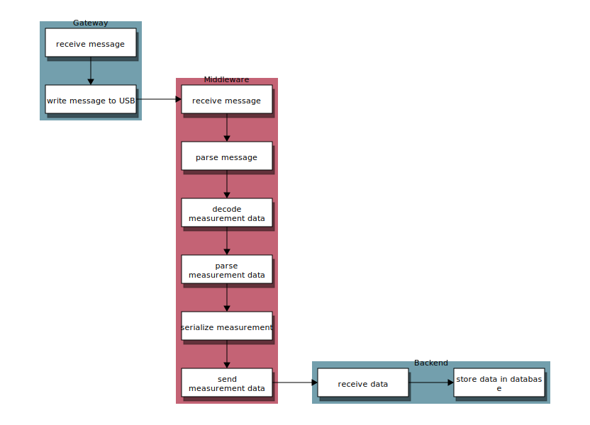

.. image:: https://github.com/hannes-hochreiner/sensor-net-middleware-rs/workflows/CI/badge.svg

Sensor Net Middleware
=====================

Middleware for the `Sensor Net Project <https://github.com/hannes-hochreiner/sensor-net>`_.

Installation
------------

.. code-block:: bash

  cargo install --git https://github.com/hannes-hochreiner/sensor-net-middleware-rs

Running
-------

The program gets its configuration from the following environment variables.

+-----------------------+--------------------------------------------------------------------------+
| Variable name         | Description                                                              |
+=======================+==========================================================================+
| SENSOR_NET_DEVICE     | The device name (e.g. "/dev/ttyUSB0")                                    |
+-----------------------+--------------------------------------------------------------------------+
| SENSOR_NET_KEY        | The sensor net encryption key as a hex encoded string                    |
+-----------------------+--------------------------------------------------------------------------+
| AUTH0_TENANT          | Tenant                                                                   |
+-----------------------+--------------------------------------------------------------------------+
| AUTH0_REGION          | Region (e.g. "eu")                                                       |
+-----------------------+--------------------------------------------------------------------------+
| AUTH0_CLIENT_ID       | Id of the client                                                         |
+-----------------------+--------------------------------------------------------------------------+
| AUTH0_CLIENT_SECRET   | Secret token of the client                                               |
+-----------------------+--------------------------------------------------------------------------+
| AUTH0_CLIENT_AUDIENCE | Audience                                                                 |
+-----------------------+--------------------------------------------------------------------------+
| SENSOR_NET_ENDPOINT   | URL of the Sensor Net endpoint (e.g. https://yourdomain.org/api/message) |
+-----------------------+--------------------------------------------------------------------------+

.. code-block:: bash

  sudo SENSOR_NET_DEVICE=/dev/ttyUSB0 SENSOR_NET_KEY=<key> \
  RUST_LOG=info AUTH0_TENANT=<tenant> AUTH0_REGION=eu \
  AUTH0_CLIENT_ID=<client> AUTH0_CLIENT_SECRET=<secret> \
  AUTH0_CLIENT_AUDIENCE=<audience> SENSOR_NET_ENDPOINT=<endpoint> \
  sensor-net-middleware-rs

Flow
----

Interfaces
----------

Input from Gateway
~~~~~~~~~~~~~~~~~~

The `gateway <https://github.com/hannes-hochreiner/sensor-net-gateway>`_ sends two kinds of messages: "info" and "rfm".
The messages are sent using "serial over USB".
They are formatted in JSON.

.. code-block:: JSON

  {
    "type": "info",
    "message": "sensor net gateway starting"
  }

.. code-block:: JSON

  {
    "type": "rfm",
    "rssi": "<rssi as string>",
    "data": "<hex encoded, AES encrypted data>"
  }

Message data
~~~~~~~~~~~~

Type 2 message (rfm)
....................

.. image:: docs/bld/rfm_packet.svg

Output to Backend
~~~~~~~~~~~~~~~~~

Messages to the `backend <https://github.com/hannes-hochreiner/sensor-net-back-end>`_ are sent over https as a "PUT" request on the "/api/message" endpoint.
The messages must be sent in JSON.

.. code-block:: JSON

  {
    "type": "rfm",
    "rssi": "-87",
    "timestamp": "2020-04-18T15:59:56.071Z",
    "message": {
      "mcuId": "005a0000-33373938-17473634",
      "index": 1524,
      "measurements": [
        {
          "sensorId": "be01",
          "parameters": {
            "temperature": { "value": 25.68000030517578, "unit": "°C" },
            "relativeHumidity": { "value": 33.9677734375, "unit": "%" },
            "pressure": { "value": 1001.1699829101562, "unit": "mbar" }
          }
        }
      ]
    }
  }

Building
--------

On Fedora 33, it may be necessary to install the Perl modules "FindBin" and "File::Compare" as well as the OpenSSL development files.

.. code-block:: bash

  sudo dnf install perl-FindBin perl-File-Compare openssl-devel -y
